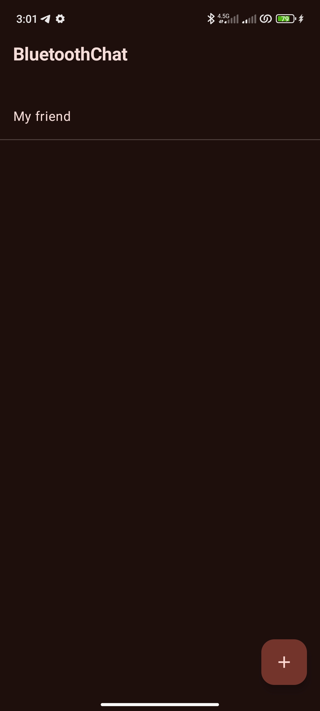
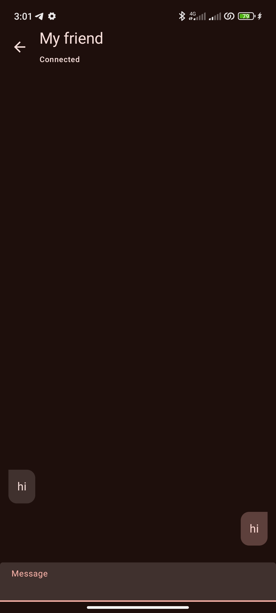

# Bluetooth Chat

A sample **Bluetooth Chat Application** built with **Kotlin** in Android Studio. This application leverages cutting-edge Android development technologies and follows the **Clean Architecture** principle to ensure scalability, testability, and maintainability.

## Screenshots

Here are some screenshots of the application in action:

| Main Screen                         | Chat Screen                         |
|-------------------------------------|-------------------------------------|
|  |  |


## Features
- **Bluetooth Chat**: Send and receive messages seamlessly between devices using Bluetooth.
- **Jetpack Compose**: Modern UI toolkit for building beautiful and reactive user interfaces.
- **Navigation Component**: Smooth navigation between screens.
- **Dependency Injection**: Powered by **Hilt** to manage dependencies efficiently.
- **Room Database**: Store and manage chat history locally.
- **Coroutines & Flow**: Handle background operations and data streams in a clean, asynchronous way.
- **Clean Architecture**: Separates concerns using data, domain, and presentation layers.

## Tech Stack
- **Language**: Kotlin
- **UI**: Jetpack Compose
- **Architecture**: Clean Architecture
- **Dependency Injection**: Hilt
- **Database**: Room
- **Navigation**: Navigation Compose
- **Concurrency**: Kotlin Coroutines & Flow

## Prerequisites
To run the project, ensure you have:
- **Android Studio** installed (latest version recommended).
- **Minimum Android SDK version**: 21 (Android 5.0 Lollipop).
- **Bluetooth must be available on devices** for testing.

## How to Run the Project
1. Clone the repository:
   ```bash
   git clone https://github.com/JustPouya/BluetoothChat.git
   ```
2. Open the project in **Android Studio**.
3. Sync the project dependencies using Gradle.
4. Build and run the project on a physical device or emulator with Bluetooth enabled.

## Project Structure
```
app/
├── data/             # Data layer: Room database, repositories
├── domain/           # Domain layer: Use cases and business logic
└── build.gradle      # Project dependencies
```

## Contributing
Contributions are welcome! If you have ideas or improvements, feel free to fork this repository and submit a pull request.

## License
This project is licensed under the **MIT License**.

---

